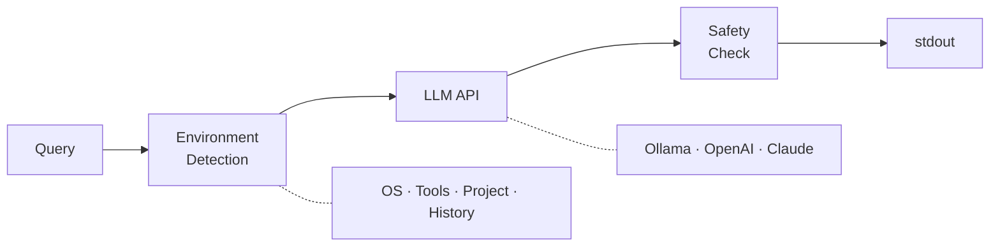

# nai

AI-powered shell command generator built with [MoonBit](https://www.moonbitlang.com/).

```
$ nai "find all .mbt files using pattern matching"
● openai/gpt-4.1-mini
rg -g '*.mbt' -l 'match'
```

## Features

- **Platform-aware** — correct flags for macOS (BSD) vs Linux (GNU)
- **Project-aware** — recognizes MoonBit, Rust, Go, Node.js, Python from cwd
- **Tool-aware** — prefers rg over grep, fd over find, etc.
- **Shell history** — recent commands as context for smarter generation
- **Safety checker** — warns about dangerous commands
- **Shell integration** — `Ctrl+]` for inline TUI input (zsh/bash/fish)
- **Interactive setup** — `nai --setup` wizard with arrow key selection
- **Multi-provider** — Ollama, OpenAI, Claude
- **Pipe-friendly** — commands to stdout, UI to stderr

## Quick Start

```sh
# Requires: MoonBit toolchain (https://www.moonbitlang.com/download/)
git clone https://github.com/paveg/nai.git && cd nai
moon install "$(pwd)/src/nai"

# Interactive setup (provider, API key, shell integration)
nai --setup

# Or configure manually
export OPENAI_API_KEY="sk-..."
nai "find files larger than 100MB"
```

## Shell Integration

```sh
nai --init zsh   # or: bash, fish
# Add the printed `source` line to your rc file
```

Press **Ctrl+]** to open an inline TUI prompt with cursor movement, backspace, and editing support. The generated command is placed in your command line buffer for review before execution.

## Usage

```sh
nai "find files larger than 100MB"
nai -e "sort directories by disk usage"       # execute with confirmation
nai --explain "find . -name '*.rs' -mtime -7" # explain a command
nai -m gpt-4.1 "complex query"                # override model
nai -p claude "list open ports"               # override provider
nai --no-history "list all processes"          # without history context
nai "search for TODO" | pbcopy                 # pipe to clipboard
nai --interactive                              # TUI input mode
```

## Config

`nai --setup` saves to `~/.config/nai/config.json`:

```json
{
  "default_provider": "openai",
  "history_depth": 10,
  "openai": {
    "api_key": "sk-...",
    "model": "gpt-4.1-mini"
  }
}
```

API keys are read from: **env var** > **config file**. Config file is created with `0600` permissions.

## Architecture



| Context | Example |
|---|---|
| OS / Shell | macOS 15.2, zsh |
| Platform tools | BSD find (`-f`), BSD sed (`-i ''`), BSD date (`-v`) |
| Available tools | rg, fd, jq, docker, gh, ... |
| Tool preferences | rg > grep, fd > find, bat > cat |
| Project type | MoonBit (*.mbt), Rust (*.rs), Go (*.go), ... |
| Recent history | last N commands from shell history |

## Development

```sh
moon build --target native
moon test --target native
moon run src/nai --target native -- "your query"
```

## License

MIT
