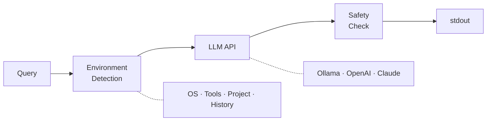

# nai

AI-powered shell command generator built with [MoonBit](https://www.moonbitlang.com/).
Type what you want in natural language, get a shell one-liner back.

```
$ nai "find all .mbt files using pattern matching"
● openai/gpt-4.1-mini
rg -g '*.mbt' -l 'match'
```

## Features

- **Natural language to shell command** — describe what you want, get a working one-liner
- **Platform-aware** — detects macOS (BSD) vs Linux (GNU) and generates correct flags
- **Project-aware** — recognizes MoonBit, Rust, Go, Node.js, Python projects from cwd
- **Tool-aware** — detects installed tools (rg, fd, jq, etc.) and prefers modern alternatives
- **Shell history context** — uses recent commands to understand your workflow
- **Safety checker** — warns about dangerous commands before output
- **Shell integration** — `Ctrl+]` to generate commands inline (zsh/bash/fish)
- **Multi-provider** — Ollama (local), OpenAI, Claude API
- **Pipe-friendly** — commands go to stdout, everything else to stderr

## Install

Requires [MoonBit toolchain](https://www.moonbitlang.com/download/).

```sh
git clone https://github.com/paveg/nai.git
cd nai
moon install "$(pwd)/src/nai"
```

The binary is installed to `~/.moon/bin/nai`. Make sure `~/.moon/bin` is in your `PATH`.

## Setup

### Provider

nai auto-detects providers in this order:

1. **Ollama** — checks `localhost:11434` (no API key needed)
2. **OpenAI** — reads `OPENAI_API_KEY` env var
3. **Claude** — reads `ANTHROPIC_API_KEY` env var

```sh
export OPENAI_API_KEY="sk-..."

# Or specify explicitly
nai --provider openai "list running containers"
nai --provider claude "disk usage by directory"
```

### Shell Integration

```sh
nai --init zsh    # or: bash, fish
# Follow the printed instructions to add `source` line to your rc file
```

Press **Ctrl+]** anywhere in your terminal to invoke nai inline. The generated command is placed in your command line buffer — review and press Enter to run.

### Config (optional)

`~/.config/nai/config.json`:

```json
{
  "default_provider": "openai",
  "history_depth": 10,
  "keybind": "^]",
  "openai": { "model": "gpt-4.1-mini" }
}
```

## Usage

```sh
nai "find files larger than 100MB"
nai -e "sort directories by disk usage"       # execute with confirmation
nai --explain "find . -name '*.rs' -mtime -7" # explain a command
nai -m gpt-4.1 "complex query"                # override model
nai --no-history "list all processes"          # without history context
nai "search for TODO" | pbcopy                 # pipe to clipboard
```

## Architecture



The system prompt is enriched with:

| Context | Example |
|---|---|
| OS / Shell | macOS 15.2, zsh |
| Platform tools | BSD find (`-f`), BSD sed (`-i ''`), BSD date (`-v`) |
| Available tools | rg, fd, jq, docker, gh, ... |
| Tool preferences | rg > grep, fd > find, bat > cat |
| Project type | MoonBit (*.mbt), Rust (*.rs), Go (*.go), ... |
| Recent history | last N commands from shell history |

## Development

```sh
moon build --target native    # build
moon test --target native     # 85 tests
moon run src/nai --target native -- "your query"
```

## Project Structure

```
src/
├── lib/
│   ├── types.mbt        # CliArgs, Provider, Environment, Config
│   ├── cli.mbt          # Argument parsing
│   ├── env.mbt          # Environment detection + prompt building
│   ├── prompt.mbt       # System prompt construction
│   ├── provider.mbt     # LLM provider configuration
│   ├── safety.mbt       # Dangerous command detection
│   ├── history.mbt      # Shell history parsing (zsh/bash/fish)
│   ├── config.mbt       # Config file loading
│   └── shell_init.mbt   # Shell integration script generation
└── nai/
    └── main.mbt         # Async entry point + IO orchestration
```

## License

MIT
